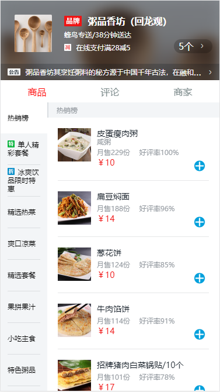
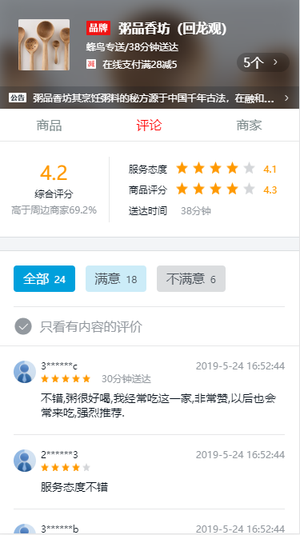
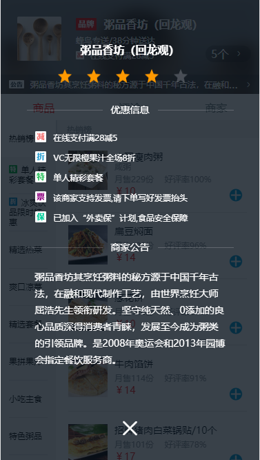
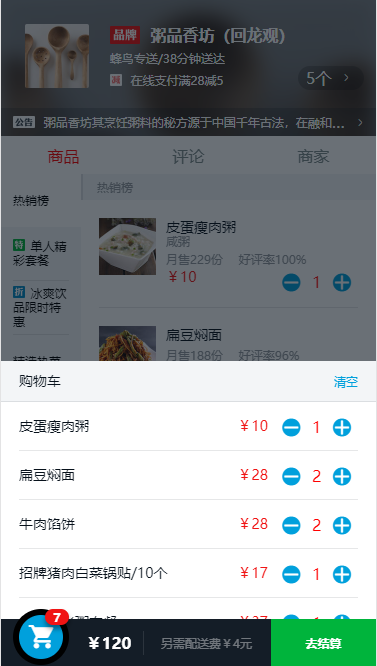

# myproject

> A Vue.js project
> 此项目是一个较简单的外卖项目，主要内容：商家详情、商家评论、点餐与购物车、商品评论。
> 所有数据来源于项目根目录下的data.json，用nodejs写了简单的数据接口。
## npm install 安装项目依赖.
## npm run server 运行后端数据接口.
## npm run dev 打包运行项目.

# 项目截图

